# poisson_blend - A simple, readable implementation of Poisson Blending

An implementation of Poisson Blending, that demonstrates the concepts explained in [my article](https://erkaman.github.io/posts/poisson_blending.html).

To use the progam, you specify a source image and a target image. The source image is seamlessly copied and pasted
into the target image, at some specified pixel location.

By running the command line

```
poisson_blend -source img/kitten.png -target img/library.png -mask img/kittenmask.png -output result.png -mx 280 -my 340
```

An image of a kitten can be seamlessly copied and pasted into the library, at the position (280, 340), as can be seen below.
The mask specifies which pixels of the kitten should actually be copied and pasted. The remaining pixels are ignored.
Note that only pure red pixels of RGB color `(255,0,0)` are considered part of the mask.

The result of the above command line can be seen below:


<table><thead>
</thead><tbody>
<tr>
<td align="center">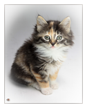</td>
<td align="center">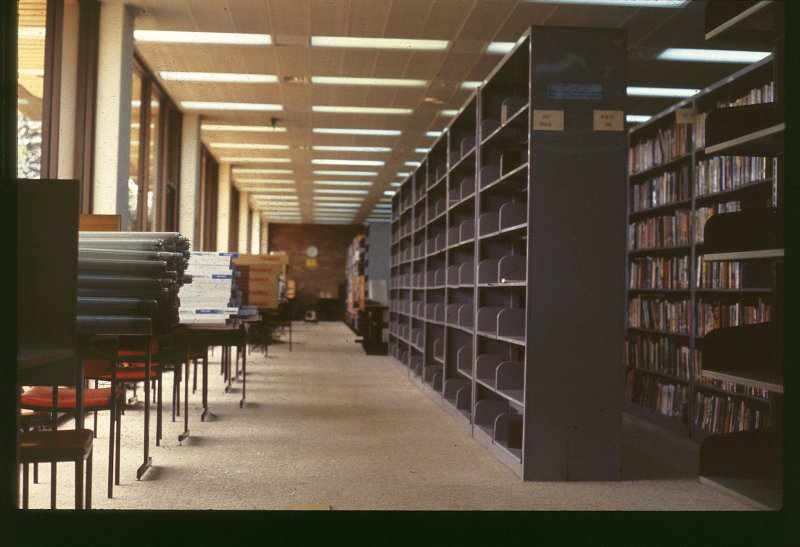</td>
<td align="center">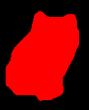</td>
<td align="center">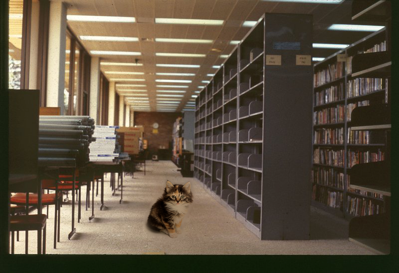</td>
</tr>
<tr>
<td align="center">source</td>
<td align="center">target</td>
<td align="center">mask</td>
<td align="center">result</td>
</tr>
</tbody></table>

## Gallery

A small gallery of images made with this program are presented below.

<table><thead>
</thead><tbody>
<tr>
<td align="center">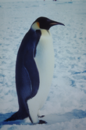</td>
<td align="center"></td>
<td align="center">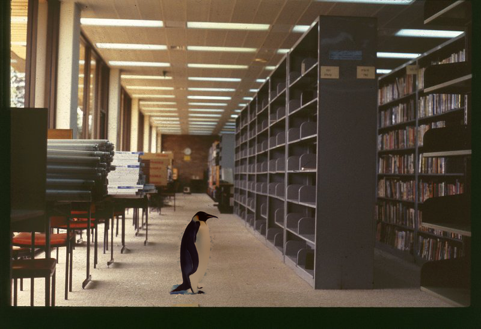</td>
</tr>
<tr>
<td align="center">source</td>
<td align="center">target</td>
<td align="center">result</td>
</tr>
</tbody></table>


<table><thead>
</thead><tbody>
<tr>
<td align="center">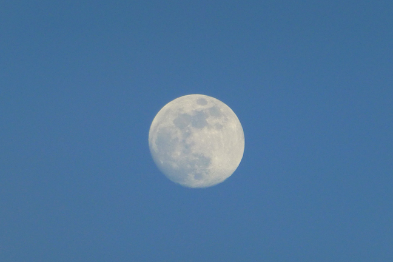</td>
<td align="center">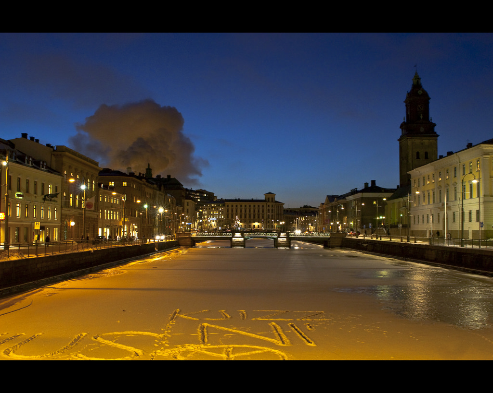</td>
<td align="center">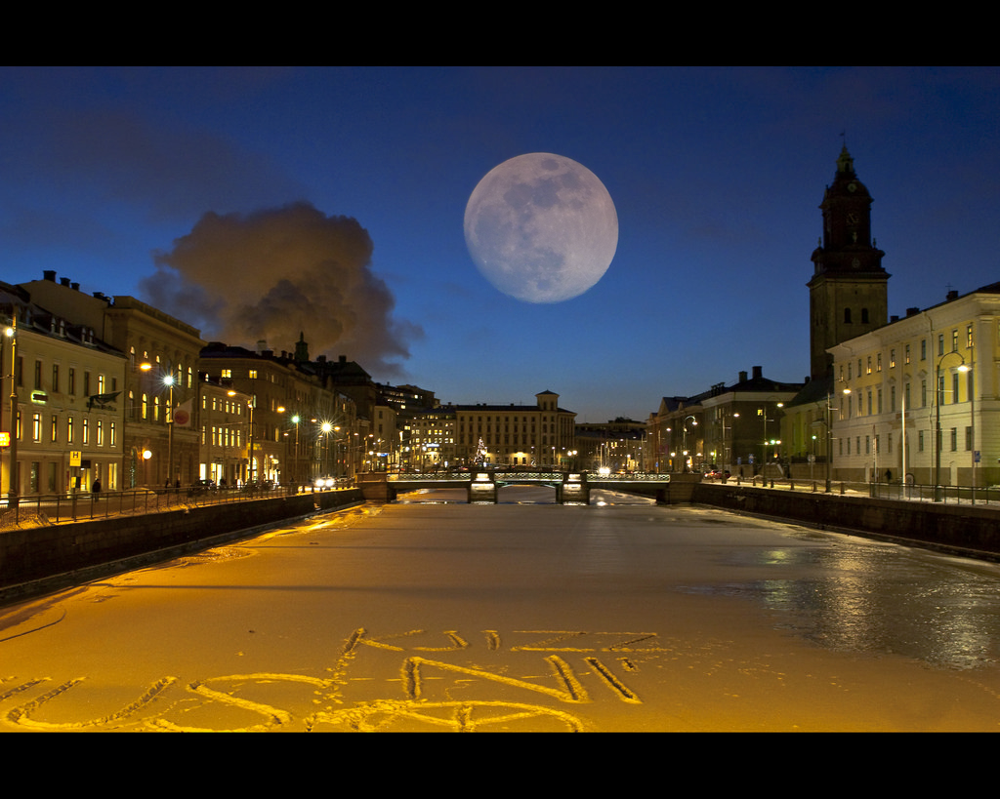</td>
</tr>
<tr>
<td align="center">source</td>
<td align="center">target</td>
<td align="center">result</td>
</tr>
</tbody></table>

<table><thead>
</thead><tbody>
<tr>
<td align="center"></td>
<td align="center">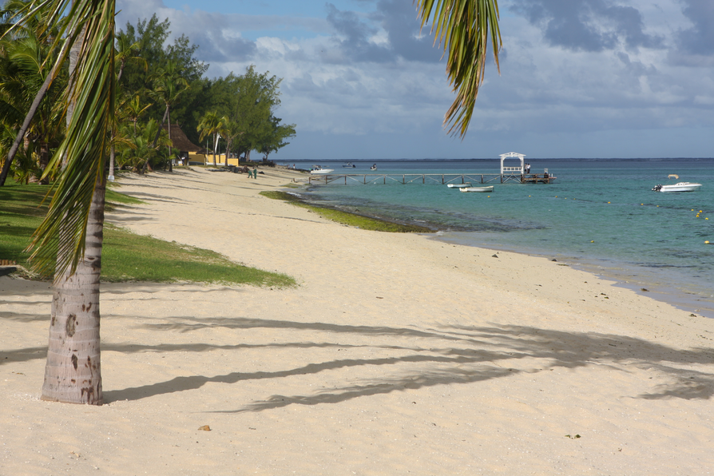</td>
<td align="center">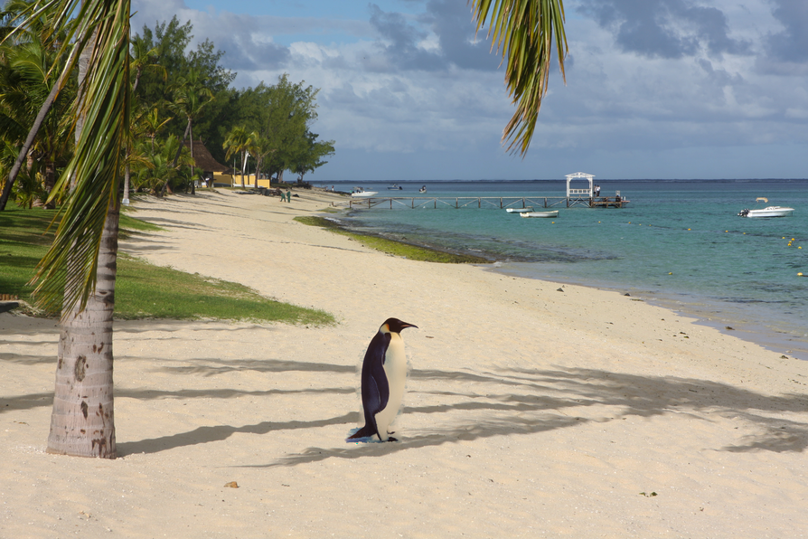</td>
</tr>
<tr>
<td align="center">source</td>
<td align="center">target</td>
<td align="center">result</td>
</tr>
</tbody></table>


<table><thead>
</thead><tbody>
<tr>
<td align="center"></td>
<td align="center"></td>
<td align="center">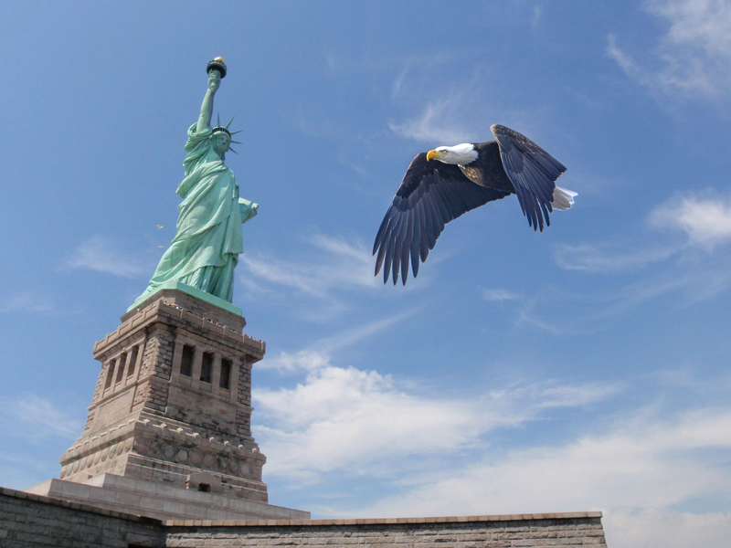</td>
</tr>
<tr>
<td align="center">source</td>
<td align="center">target</td>
<td align="center">result</td>
</tr>
</tbody></table>

<table><thead>
</thead><tbody>
<tr>
<td align="center"></td>
<td align="center">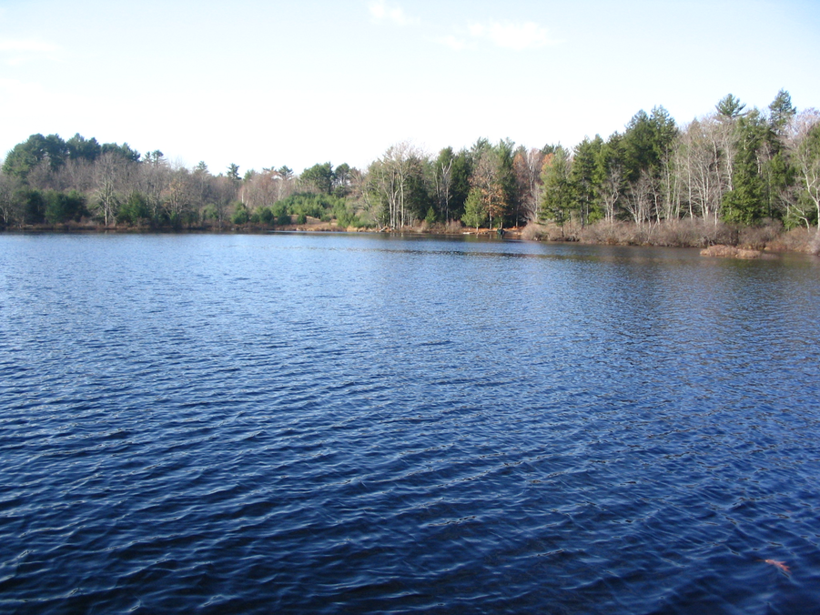</td>
<td align="center">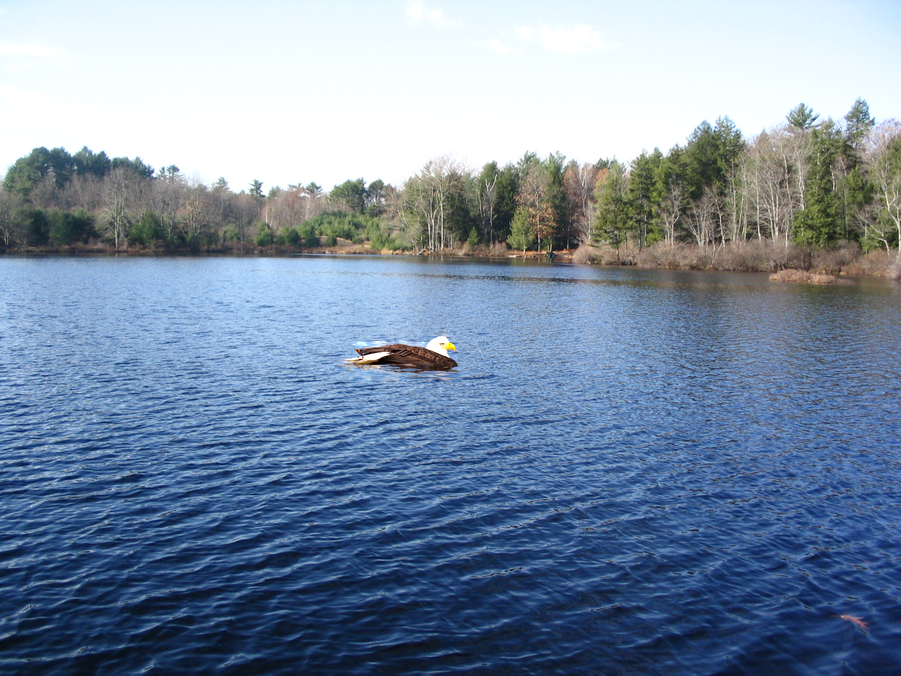</td>
</tr>
<tr>
<td align="center">source</td>
<td align="center">target</td>
<td align="center">result</td>
</tr>
</tbody></table>


<table><thead>
</thead><tbody>
<tr>
<td align="center"></td>
<td align="center">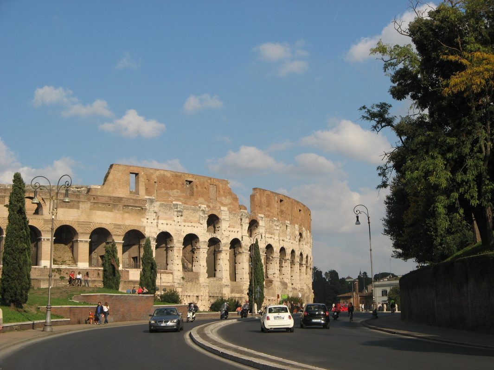</td>
<td align="center">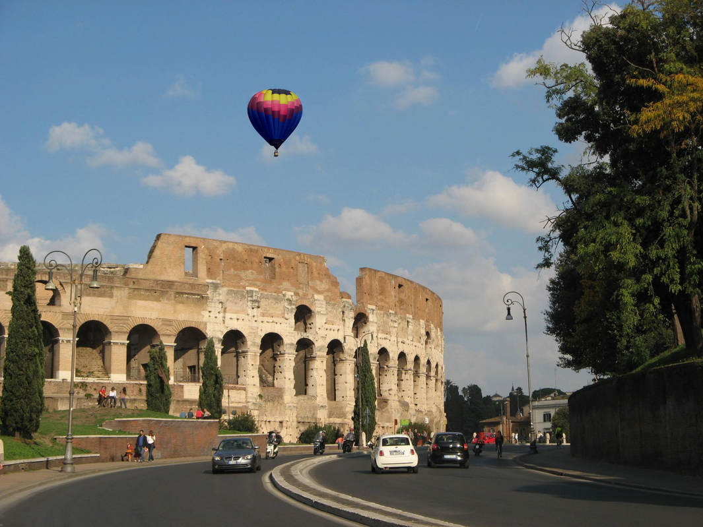</td>
</tr>
<tr>
<td align="center">source</td>
<td align="center">target</td>
<td align="center">result</td>
</tr>
</tbody></table>

## Building

The only dependencies are [lodepng](https://github.com/lvandeve/lodepng) and [Eigen](http://eigen.tuxfamily.org/index.php?title=Main_Page).
Both of which are included within this repository.

We use CMake for building. If on Linux or OS X, you can build it in the terminal by doing something like:

```
mkdir build && cd build && cmake .. && make
```

If on Windows, create a `build/` folder, and run `cmake ..` from
inside that folder. This will create a visual studio solution(if you
have visual studio). Launch that solution, and then simply compile the
project named `poisson_blend`.

## Image Sources

Below we list the soures of all images that we used in the gallery.

- [kitten.png](https://www.flickr.com/photos/rondeboom/9296207416/)
- [library.png](https://www.flickr.com/photos/uowarchives/5513608992/)
- [gothenburg.png](https://www.flickr.com/photos/belola/4257701496/)
- [moon.png](https://www.flickr.com/photos/dcmaster/7533083314/)
- [penguin.png](https://www.flickr.com/photos/141457238@N03/26834524313/)
- [beach.png](https://www.flickr.com/photos/notcub/2568905280)
- [liberty.png](https://www.flickr.com/photos/reinholdbehringer/3698799772/)
- [eagle.png](https://www.flickr.com/photos/bobengr/32130057682/)
- [lake.png](https://www.flickr.com/photos/74444001@N00/62802646)
- [watereagle.png](https://www.flickr.com/photos/mickthompson/16549423644)
- [collosseum.png](https://www.flickr.com/photos/sandravoetbal/4075677218)
- [balloon.png](https://www.flickr.com/photos/prestonkemp/4655399966/)


